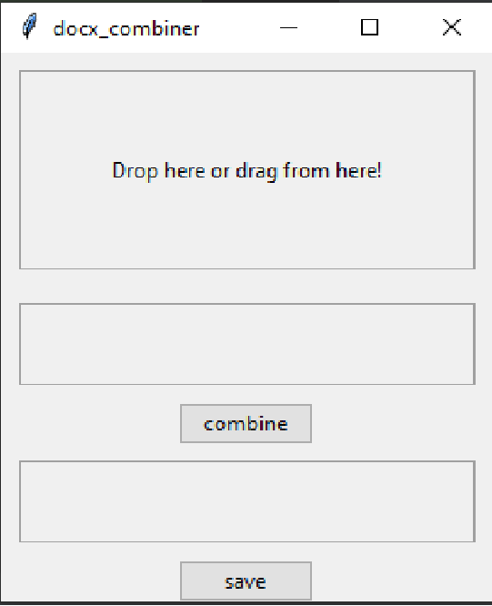

# Usage combine_words.py 
## Requirement
### python 3.8+ 
    python-docx==0.8.11
    docxcompose==1.3.0
    argparse==1.4.0
    pip install pywin32==302
## command
```bash
python combine.py --files test1.docx test2.docx test3.docx --dst combined.docx
```
## GUI
### python main.py
